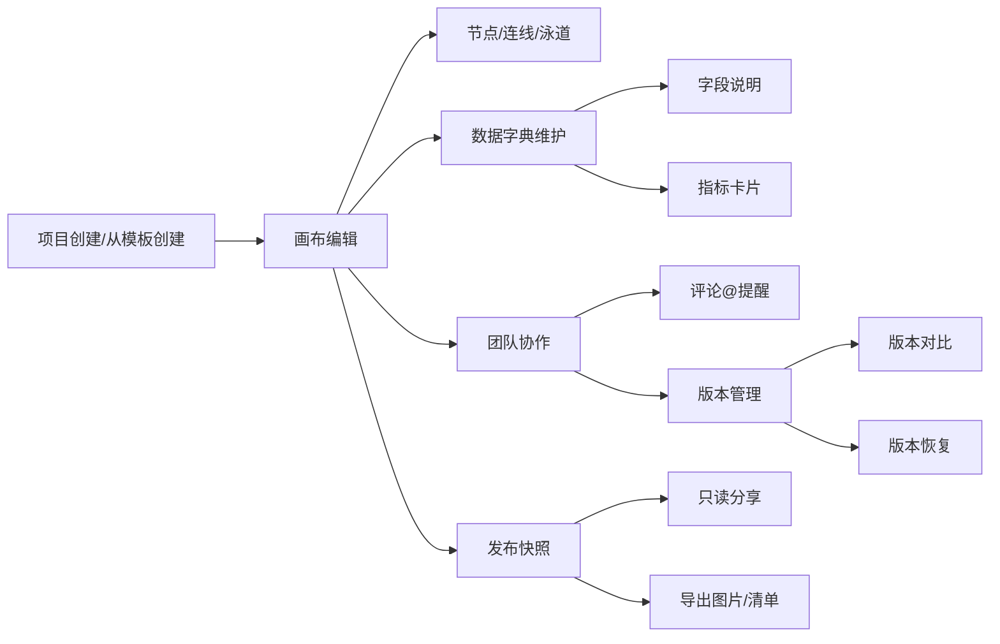

## 1. 产品概述

DataFlow 是一款面向运营、分析和产品团队的多用户数据设计绘图协作平台，帮助团队协作整理业务结构、指标关系与流程草图，通过可视化画布、数据字典管理和团队协作功能，提升跨团队沟通效率和数据治理水平。

- 核心价值：让数据和产品、运营、分析团队在同一平台上协作设计数据架构与业务流程，从模板快速起稿，逐步完善图形与说明

## 2. 核心功能

### 2.1 用户角色

| 角色 | 描述 | 核心权限 |
|------|------|----------|
| 管理员 | 项目负责人/团队管理员 | 项目管理、成员管理、权限分配、发布管理 |
| 编辑者 | 产品经理/数据分析师/运营 | 画布编辑、数据字典维护、评论、版本查看 |
| 查看者 | 外部协作者/利益相关者 | 只读查看、评论、导出 |

### 2.2 功能模块

1. **项目页**：项目列表、项目创建、项目搜索、项目卡片展示
2. **画布页**：节点拖拽、连线、图层管理、泳道布局、颜色标记、指标卡片、撤销重做
3. **数据字典页**：字段说明维护、指标卡片录入、分类管理
4. **模板页**：模板库浏览、模板复用、从模板创建项目
5. **评论页**：批注讨论、@提醒、评论列表
6. **版本页**：历史版本、版本对比、版本恢复
7. **发布页**：发布快照、只读分享、权限控制、导出图片与清单、变更记录

### 2.3 页面详情

| 页面名称 | 模块名称 | 功能描述 |
|----------|----------|----------|
| 项目页 | 顶部导航 |  Logo、搜索、用户头像、新建项目按钮 |
| 项目页 | 项目列表 | 项目卡片网格、项目筛选、最近访问 |
| 项目页 | 新建项目 | 项目名称、描述、模板选择、创建按钮 |
| 画布页 | 左侧工具栏 | 节点类型、形状工具、文本工具 |
| 画布页 | 中间画布区 | 无限画布、缩放平移、节点编辑、连线 |
| 画布页 | 右侧属性面板 | 节点属性、颜色、样式、图层管理 |
| 画布页 | 顶部操作栏 | 撤销重做、缩放、视图切换、导出 |
| 画布页 | 泳道布局 | 横向/纵向泳道、泳道标题编辑 |
| 数据字典页 | 分类导航 | 字段分类、指标分类 |
| 数据字典页 | 字段列表 | 字段名称、类型、说明、编辑操作 |
| 数据字典页 | 字段详情 | 字段属性、关联指标、备注 |
| 数据字典页 | 指标卡片 | 指标名称、计算公式、业务含义 |
| 模板页 | 模板分类 | 业务流程、数据架构、指标体系 |
| 模板页 | 模板预览 | 模板缩略图、模板说明、使用模板 |
| 模板页 | 我的模板 | 自定义模板管理 |
| 评论页 | 评论列表 | 评论时间线、评论内容、回复 |
| 评论页 | 评论输入 | 文本输入、@提及、附件 |
| 评论页 | 批注标记 | 画布位置关联批注 |
| 版本页 | 版本列表 | 版本号、时间、作者、变更说明 |
| 版本页 | 版本对比 | 双画布对比、差异高亮 |
| 版本页 | 版本恢复 | 恢复到指定版本 |
| 发布页 | 发布快照 | 发布版本、发布说明 |
| 发布页 | 分享设置 | 只读链接、权限设置、有效期 |
| 发布页 | 导出功能 | 导出图片、导出清单（CSV/JSON） |
| 发布页 | 变更记录 | 关键变更历史、操作日志 |

## 3. 核心流程

用户从模板页或空白项目开始，在画布上拖拽节点、连线、添加泳道，逐步完善业务结构图；同时在数据字典中维护字段说明和指标卡片；团队成员通过评论和@提醒进行协作讨论；每次重要节点发布快照并生成只读分享链接供外部查看；所有操作均有版本记录，支持历史版本可对比和恢复。

## 4. 用户界面设计

### 4.1 设计风格

- **主色调**：深邃靛蓝 #1E3A5F 作为主色，搭配青绿色 #10B981 作为强调色
- **辅助色**：琥珀色 #F59E0B 用于警告/标记，玫红色 #EF4444 用于删除/错误
- **中性色**：从 #F8FAFC 浅灰背景，#1E293B 深色文本
- **按钮风格**：圆角 8px，悬停微阴影，点击反馈
- **字体**：标题使用 Playfair Display 衬线字体增强专业感，正文使用 Inter 无衬线字体保证可读性
- **布局风格**：三栏布局（左工具栏 + 中画布 + 右属性），卡片式设计，清晰的视觉层次
- **图标风格**：线性图标，统一 24px 网格，简洁现代

### 4.2 页面设计概览

| 页面名称 | 模块名称 | UI 元素 |
|----------|----------|---------|
| 项目页 | 项目列表 | 卡片网格、悬停动效、渐变封面图、统计数字角标 |
| 画布页 | 画布区域 | 无限画布、网格背景、节点阴影、连线贝塞尔曲线 |
| 画布页 | 工具栏 | 图标按钮、选中态高亮、拖拽提示 |
| 数据字典页 | 列表 | 表格、标签、筛选标签、搜索框 |
| 模板页 | 模板卡片 | 缩略图、标签、使用统计、悬停放大 |
| 评论页 | 评论区 | 头像、时间线、回复嵌套、@高亮 |
| 版本页 | 对比视图 | 左右分栏、差异高亮、时间轴 |
| 发布页 | 发布卡片 | 状态标签、二维码、链接复制 |

### 4.3 响应式设计

- 桌面端优先（Desktop-first
- 平板端：左侧工具栏可收起
- 移动端：底部标签页切换，画布全屏
- 触摸优化：拖拽、缩放手势支持

### 4.4 动效与交互

- 页面加载：渐入 + 位移
- 节点拖拽：磁吸效果
- 悬停：微缩放 + 阴影加深
- 模态框：背景模糊 + 渐显
- 画布缩放：平滑过渡
