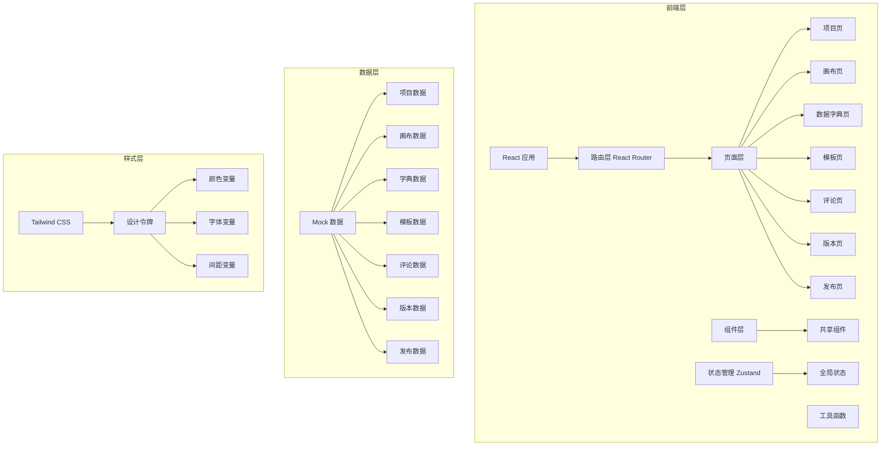

## 1. 架构设计



## 2. 技术描述

- **前端框架**: React 18 + TypeScript
- **构建工具**: Vite 5
- **样式方案**: Tailwind CSS 3
- **状态管理**: Zustand
- **路由方案**: React Router v6
- **图标库**: Lucide React
- **画布渲染**: SVG + 自定义拖拽
- **导出功能**: html2canvas
- **日期处理**: date-fns
- **无后端**: 纯前端 Mock 数据，LocalStorage 持久化

## 3. 路由定义

| 路由 | 页面 | 描述 |
|------|------|------|
| `/` | 项目页 | 项目列表、搜索、创建项目 |
| `/project/:id/canvas` | 画布页 | 核心绘图编辑 |
| `/project/:id/dictionary` | 数据字典页 | 字段与指标管理 |
| `/templates` | 模板页 | 模板库浏览与使用 |
| `/project/:id/comments` | 评论页 | 批注与讨论 |
| `/project/:id/versions` | 版本页 | 历史版本与对比 |
| `/project/:id/publish` | 发布页 | 发布与分享 |

## 4. 数据模型

### 4.1 数据模型定义

```mermaid
erDiagram
    PROJECT {
        string id
        string name
        string description
        string coverColor
        string ownerId
        string role
        datetime createdAt
        datetime updatedAt
    }
    
    NODE {
        string id
        string type
        string label
        float x
        float y
        float width
        float height
        string color
        string layer
        string laneId
    }
    
    EDGE {
        string id
        string source
        string target
        string label
        string style
    }
    
    LANE {
        string id
        string title
        string direction
        float y
        float height
    }
    
    DATA_FIELD {
        string id
        string name
        string type
        string description
        string category
        string[] relatedMetrics
    }
    
    METRIC {
        string id
        string name
        string formula
        string meaning
        string category
    }
    
    TEMPLATE {
        string id
        string name
        string description
        string thumbnail
        string category
        int usageCount
    }
    
    COMMENT {
        string id
        string content
        string userId
        string userName
        string avatar
        datetime createdAt
        string[] mentions
        string position
    }
    
    VERSION {
        string id
        string version
        datetime createdAt
        string author
        string description
        object snapshot
    }
    
    PUBLISH {
        string id
        string version
        string description
        string shareUrl
        string permission
        datetime expireAt
        datetime createdAt
    }
```



### 4.2 核心数据结构

```typescript
// 项目
interface Project {
  id: string;
  name: string;
  description: string;
  coverColor: string;
  ownerId: string;
  role: 'admin' | 'editor' | 'viewer';
  createdAt: string;
  updatedAt: string;
  members: ProjectMember[];
}

// 画布节点
interface CanvasNode {
  id: string;
  type: 'rectangle' | 'circle' | 'diamond' | 'metric' | 'process' | 'data' | 'text';
  label: string;
  x: number;
  y: number;
  width: number;
  height: number;
  color: string;
  layer: number;
  laneId?: string;
  data?: Record<string, any>;
}

// 连线
interface CanvasEdge {
  id: string;
  source: string;
  target: string;
  label?: string;
  style: 'solid' | 'dashed' | 'arrow';
}

// 泳道
interface Lane {
  id: string;
  title: string;
  direction: 'horizontal' | 'vertical';
  position: number;
  size: number;
}

// 数据字段
interface DataField {
  id: string;
  name: string;
  type: 'string' | 'number' | 'boolean' | 'date' | 'object' | 'array';
  description: string;
  category: string;
  relatedMetrics: string[];
  required: boolean;
  defaultValue?: string;
}

// 指标
interface Metric {
  id: string;
  name: string;
  formula: string;
  meaning: string;
  category: string;
  unit?: string;
}

// 模板
interface Template {
  id: string;
  name: string;
  description: string;
  thumbnail: string;
  category: string;
  usageCount: number;
  nodes: CanvasNode[];
  edges: CanvasEdge[];
}

// 评论
interface Comment {
  id: string;
  content: string;
  userId: string;
  userName: string;
  avatar: string;
  createdAt: string;
  mentions: string[];
  position?: { x: number; y: number };
  replies: Comment[];
}

// 版本
interface Version {
  id: string;
  version: string;
  createdAt: string;
  author: string;
  description: string;
  snapshot: {
    nodes: CanvasNode[];
    edges: CanvasEdge[];
    lanes: Lane[];
  };
}

// 发布
interface Publish {
  id: string;
  version: string;
  description: string;
  shareUrl: string;
  permission: 'private' | 'view_only' | 'comment';
  expireAt?: string;
  createdAt: string;
  changeLog: ChangeLogItem[];
}

// 变更记录
interface ChangeLogItem {
  id: string;
  action: string;
  user: string;
  timestamp: string;
  description: string;
}
```

## 5. 目录结构

```
src/
├── components/          # 共享组件
│   ├── Layout/         # 布局组件
│   ├── common/         # 通用组件（按钮、模态框等）
│   └── canvas/         # 画布相关组件
├── pages/              # 页面组件
│   ├── Projects/       # 项目页
│   ├── Canvas/         # 画布页
│   ├── Dictionary/     # 数据字典页
│   ├── Templates/      # 模板页
│   ├── Comments/       # 评论页
│   ├── Versions/       # 版本页
│   └── Publish/        # 发布页
├── store/              # 状态管理
│   ├── useProjectStore.ts
│   ├── useCanvasStore.ts
│   └── useUserStore.ts
├── data/               # Mock 数据
│   ├── projects.ts
│   ├── templates.ts
│   └── mockData.ts
├── utils/              # 工具函数
│   ├── canvas.ts
│   ├── export.ts
│   └── helpers.ts
├── types/              # 类型定义
│   └── index.ts
├── App.tsx
├── main.tsx
└── index.css
```
